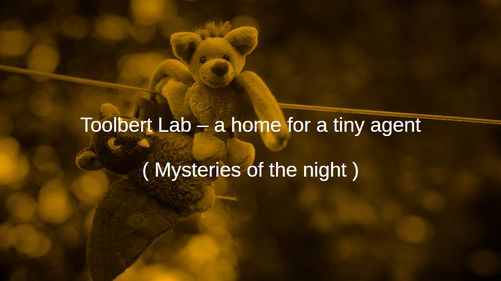

# Toolbert Lab - a home for a tiny agent

This repository started as a project work for the [OpenCampus.sh](https://www.opencampus.sh/) course [*From LLMs to Agents*](https://edu.opencampus.sh/course/632). OpenCampus is a non-profit organization working in close collaboration with local universities. ECTS-Credits are granted for some of their projects.

**[Open full presentation (PDF)](docs/toolbert_lab.pdf)** — course summary (sessions 1–8).

Course deliverable: **sessions 1–8** (session 8 is a rough end-to-end demo). This repository
continues for experiments (**session 9+**).

## Why this lab?

Agents need a **home and supervision** — like kids at play, but for LLM graphs. Toolbert Lab is
that home: a local Compose stack where you develop LangGraph agents in notebooks while
infrastructure handles models, tracing, chaos testing, and (eventually) sandboxed tool execution.

The agent task is **deliberately tiny** — extract TODOs from text, mask email PII, format, demask —
so the course can focus on engineering mechanics: **state boundaries**, **deterministic guards**,
**tracing**, and **tool sandboxing**. Session notebooks and the [presentation PDF](docs/toolbert_lab.pdf)
carry the narrative; this repo is the runnable lab archive.

## Course sessions (1–8)

| Session | Focus | Notebooks |
|---------|--------|-----------|
| 1 | Chaos channel (Toxiproxy), home assignment | [`chaos.ipynb`](src/assorted/session1/chaos.ipynb), [`homeassignment.ipynb`](src/assorted/session1/homeassignment.ipynb) |
| 2 | RAG basics (vector search in the lab) | [`rag_basics.ipynb`](src/assorted/session2/rag_basics.ipynb), [`rag_pgvector.ipynb`](src/assorted/session2/rag_pgvector.ipynb) |
| 3 | LangGraph basics, message reducer | [`langgraph.ipynb`](src/assorted/session3/langgraph.ipynb), [`langgraph_messages.ipynb`](src/assorted/session3/langgraph_messages.ipynb) |
| 4 | Parent graph assembly (PII → TODO → demask) | [`langgraph.ipynb`](src/assorted/session4/langgraph.ipynb) |
| 5 | Phoenix tracing, reducer observability | [`graphtrace.ipynb`](src/assorted/session5/graphtrace.ipynb) |
| 6 | Tool subgraph with safe mock tool | [`tool_node_basics.ipynb`](src/assorted/session6/tool_node_basics.ipynb) |
| 7 | Sandbox infrastructure (Sysbox HTTP API) | [`tool_node_sysbox.ipynb`](src/assorted/session7/tool_node_sysbox.ipynb) |
| 8 | End-to-end parent graph (rough) — Sysbox + in-graph demask | [`presentation.ipynb`](src/assorted/session8/presentation.ipynb) |

Full notebook index: [`src/assorted/README.md`](src/assorted/README.md).

## Lab and documentation

- [Getting started](docs/getting-started.md) — start the agent lab, first Python exercise in `dev`
- [Course pipeline and nodes](docs/course/pipeline-and-nodes.md) — parent-graph sketch and modules
- [Error handling (course)](docs/course/error-handling.md) — Guard / Observe / Library
- [Editor and agent workflow](docs/editor-and-agent-workflow.md) — Cursor, dev-cmd, contributors
- [Compose stack](container/compose/README.md) — runtime, env, chaos channel
- [Full documentation index](docs/README.md)

## Beyond the course (session 9+)

Follow-up experiments and ad-hoc notebooks may appear under `src/assorted/` without being part of the course deliverable (sessions 1–8).

## Course description (OpenCampus.sh)

> Adapted from the OpenCampus.sh course *From LLM to Agents* (instructor: [Henrik Horst](https://opencampus.sh)).  
> This repository is an independent lab archive maintained by Ulf Wendel — not the official course repository.

### What you get

Ramp-up course for the new fascinating capabilities of LLMs and the emerging applications of AI Agents with LLMs as the control center.

### Paths

Throughout the course we will build multiple different applications on different levels of difficulty.

There are several tracks depending on your level of expertise:

"Taster" : You take the course only to get an overview grasp of the concepts

"Beginner": You do not have a lot of experience but want to build first prototypes

"Intermediate": You want to level up your already existing skills and knowledge

"Expert": You really want to deep dive in the materials both from practical as from a theoretical perspective

You can choose the path you want to take, so that the course is open for everybody interested in the topic. We achieve those different paths with more and more in depth learning materials and tasks for the more advanced paths. You are free to choose your path and change it during the semester

### About the course instructor

Henrik Horst teaches Machine Learning courses at opencampus.sh since 5 years. Also he is a Generative AI course instructor at the Helmholtz Gesellschaft and the Wirtschaftsakademie Schleswig-Holstein. He works as CEO at WikiMind GmbH, an AI-Software company, and has carried out multiple AI projects there.

### Guest speakers

There will be during the course some guest speakers invited to talk about their life as an AI engineer

### What you should bring

Basic Programming Knowledge in Python!!

A prerequisite is Python skills, if you are lacking those first take the course: Python Programming: Beginner to Practitioner

Otherwise that is all for the "Taster" and "Beginner" path. For the more advanced paths more programming and project experience is necessary and also familiarity with different software tools like git and docker.

## License

Copyright 2026 Ulf Wendel. Licensed under the Apache License 2.0 — see [LICENSE](LICENSE).

Repository code, docs, and lab materials: Apache 2.0 (see LICENSE).  
The course description section above is third-party course marketing text from OpenCampus.sh.
