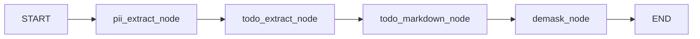

# Pipeline and nodes

Map of the **course reference** parent-graph arc (**sessions 1–8**). Session **8** is still rough
but part of the deliverable: the full in-graph pipeline including Sysbox and demask. Session
notebooks are the primary walkthrough; this page is an orientation map.

## Parent graph chain

Factory: `build_parent_base_graph()` in `src/graphs/parent_base_graph.py`. The graph
assembly in code and in session notebooks may diverge where notebooks are notebook-led.

| Step | Kind | Role |
|------|------|------|
| `pii_extract_node` | LLM detect + Python mask | Find emails, replace with placeholders (`E{n}_{salt}`) |
| `todo_extract_node` | Subgraph (bridge) | Structured TODO list from masked text |
| `todo_markdown_node` | Subgraph (bridge) | Markdown summary from TODO list |
| `demask_node` | Deterministic | Restore placeholders in `final_result` (node-agnostic demask slot) |

Shared state: `GlobalState` in `src/llm_nodes/global_state.py` (`messages`, `pii_email`,
`todo_list`, `final_result`, `todo_markdown`, `todo_text`). Result bridges set `final_result`
to the masked deliverable; `demask_node` restores only `final_result`. Node-specific fields
(`todo_markdown`, `todo_text`) stay masked after demask.

## Subgraph and bridge pattern

TODO work runs in **isolated subgraphs** (`todo_extract`, `todo_markdown`) compiled on
smaller state types. **Bridges** in `src/llm_nodes/todo_extract/graph.py` and
`todo_markdown/graph.py`:

- Pass **masked text** and a **placeholder allowlist** (token strings only — no raw emails)
  into the subgraph.
- Merge subgraph results back onto `GlobalState` (including `final_result` for demask).
- Forward LangGraph `config` (thread id, tracing) into nested `ainvoke`.

After each subgraph LLM step, **placeholder audit** checks output tokens against the
allowlist (Observe tier today). See `src/llm_nodes/placeholder_audit/README.md`.

## Cross-cutting: `messages` and reducer

`GlobalState.messages` uses `session_message_reducer` — policy hooks outside individual
nodes (read/transform on message traffic). Wrap runs in `reducer_session` so the active
reducer applies per `thread_id`.

Introduction: `src/reducer/__init__.py` (module docstring). Notebook demo:
`src/assorted/session3/langgraph_messages.ipynb`.

## LLM client channels

Nodes use `src/llm_handle/local.py` (`get_async_openai_client`, `openai_client_context`):

- **Clean channel** — `MODEL_BASE_URL_CLEAN` (baseline path)
- **Chaos channel** — `MODEL_BASE_URL_CHAOS` (edge/provider faults via Toxiproxy)

`build_parent_base_graph(..., chaos=True)` selects the chaos base URL for course L6 tests.

## Module map

| Module | README / entry |
|--------|----------------|
| PII email | `src/llm_nodes/pii_email/README.md` |
| Placeholder audit | `src/llm_nodes/placeholder_audit/README.md` |
| TODO extract / markdown | `src/llm_nodes/todo_extract/graph.py`, `todo_markdown/graph.py` |
| Tool subgraph (mock tool) | `src/llm_nodes/tool_node_loop/` — Session 6; safe `greet()` mock; not in parent sketch yet |
| Sandbox bridge (Sysbox) | `src/llm_nodes/tool_node_sysbox_bash/README.md` — Session 7; HTTP → `sysbox_bash` |
| Demask | `src/other_nodes/demask/` |
| Parent graph | `src/graphs/parent_base_graph.py` |

## Notebooks (by session)

| Session | Focus |
|---------|--------|
| 1 | Chaos channel (Toxiproxy), home assignment |
| 2 | RAG basics (pgvector in the lab) |
| 3 | LangGraph basics, reducer messages |
| 4 | Parent graph assembly (notebook-led; `src/graphs/` mirrors when synced) |
| 5 | Phoenix tracing on parent-graph sketch — `session5/graphtrace.ipynb` (first-run exercise in getting started) |
| 6 | Tool subgraph with safe mock `greet` — `session6/tool_node_basics.ipynb` (`tool_node_loop`; notebook-led, not in parent sketch) |
| 7 | Sandbox infrastructure (Sysbox HTTP API) — `session7/tool_node_sysbox.ipynb` (`tool_node_sysbox_bash`; teaching prose in notebook) |
| 8 | End-to-end parent graph (rough) — full pipeline (PII → TODO → Sysbox bash → demask) — `session8/presentation.ipynb` |

Index: `src/assorted/README.md`.

## Tests

| Layer | What |
|-------|------|
| L1–L2 | Unit / node mocks — `src/tests_and_evals/tests/llm_nodes/` |
| L3 | Parent graph mock E2E — `test_parent_base_graph_mock.py`; Sysbox subgraph mock — `tool_node_sysbox_bash/` |
| L6 | Chaos via Toxiproxy — `test_parent_base_graph_chaos.py` |

Sysbox Sandbox API contract (outside pytest layers): `make sysbox-bash-api-smoke`.

Marker and env requirements: `src/tests_and_evals/README.md`.

## Related

- [Error handling](error-handling.md) — Guard / Observe / Library on this pipeline
- [Getting started](../getting-started.md) — start the agent lab and first exercise in `dev`
- [ADR 0009 — PII pipeline](../auto-doc/adr/0009-pii-email-masking-pipeline.md)
- [ADR 0014 — Sysbox LangGraph bridge](../auto-doc/adr/0014-tool-node-sysbox-bash-langgraph-bridge.md)
- [ADR 0015 — Sandbox HTTP API](../auto-doc/adr/0015-sysbox-bash-sandbox-http-api.md)
